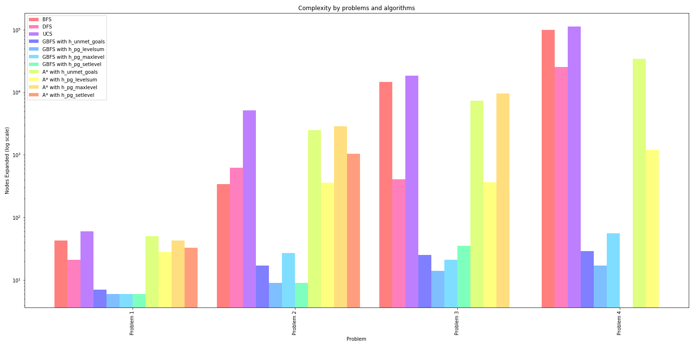
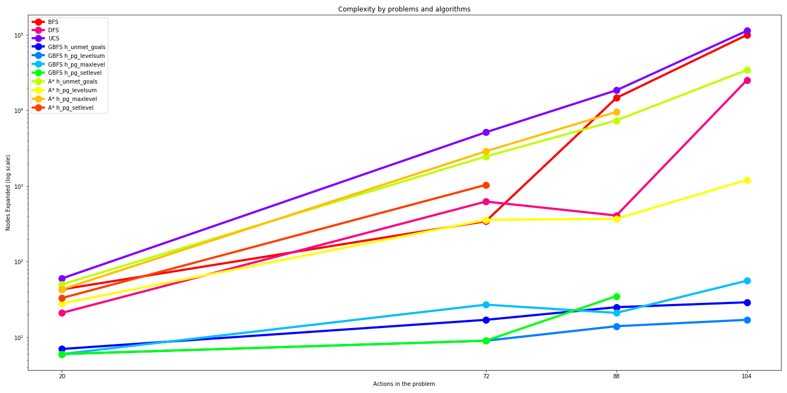
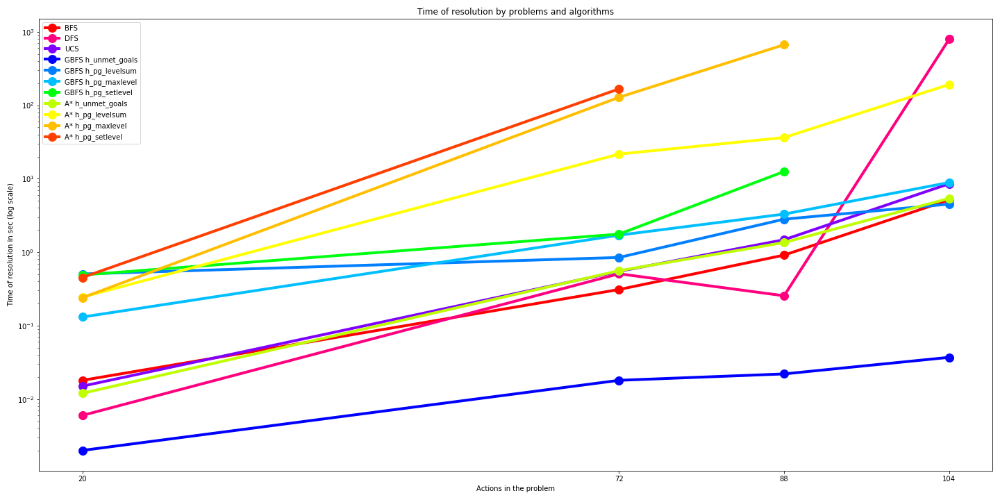
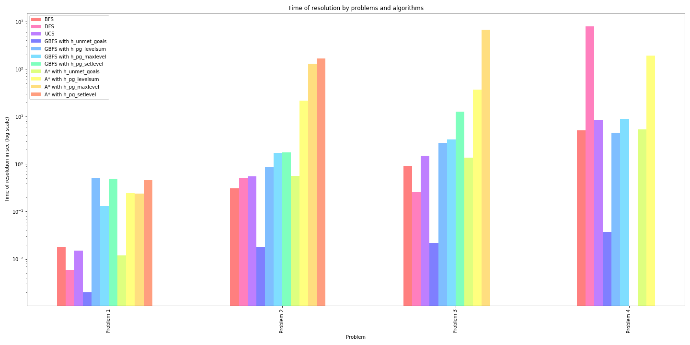
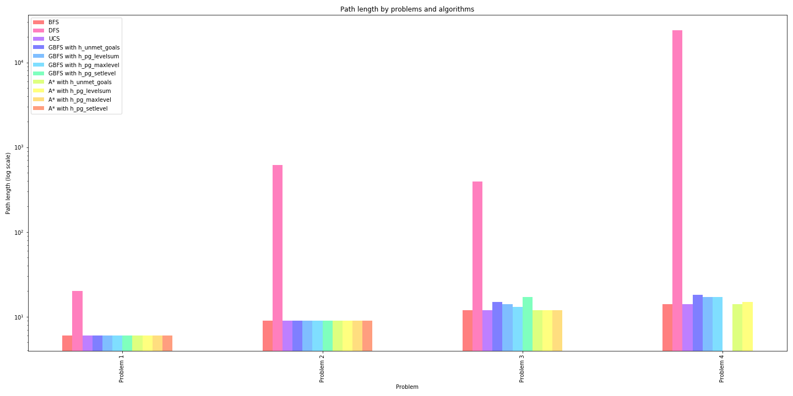
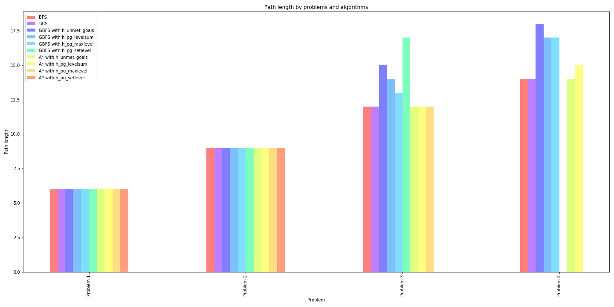

# PROJECT 3 - Build a Forward-Planning Agent

###### Antoine Mertz
###### 17 October 2019

### Introduction

Planning is an important topic in AI because intelligent agents are expected to automatically plan their own actions in uncertain domains. Planning and scheduling systems are commonly used in automation and logistics operations, robotics and self-driving cars, and for aerospace applications like the Hubble telescope and NASA Mars rovers.

This project is split between implementation and analysis. First you will combine symbolic logic and classical search to implement an agent that performs progression search to solve planning problems. Then you will experiment with different search algorithms and heuristics, and use the results to answer questions about designing planning systems.

Here it is the report of the analysis part.

### Planning Problem

We were given 4 planning problems in the Air Cargo domain that use the same action schema:

```
Action(Load(c, p, a),
	PRECOND: At(c, a) ∧ At(p, a) ∧ Cargo(c) ∧ Plane(p) ∧ Airport(a)
	EFFECT: ¬ At(c, a) ∧ In(c, p))

Action(Unload(c, p, a),
	PRECOND: In(c, p) ∧ At(p, a) ∧ Cargo(c) ∧ Plane(p) ∧ Airport(a)
	EFFECT: At(c, a) ∧ ¬ In(c, p))

Action(Fly(p, from, to),
	PRECOND: At(p, from) ∧ Plane(p) ∧ Airport(from) ∧ Airport(to)
	EFFECT: ¬ At(p, from) ∧ At(p, to))
```

The different problems have different initial states and goals. The cargo problem instances have different numbers of airplanes, cargo items, and airports that increase the complexity of the domains. The goal of the analysis is to experiment with different search algorithms and heuristics, and use the results to answer questions about designing planning systems.

The following sections will sum up in tables the results of different search algorithms: uninformed vs informed searches. Then we will analyse these results through graphics and try to answer correctly to the 3 followings questions:

* Which algorithm or algorithms would be most appropriate for planning in very restricted domain and needs to operate in real time?

* Which algorithm or algorithms would be most appropriate for planning in very large domains?

* Which algorithm or algorithms would be most appropriate for planning where it is important to find only optimal plans?


### Results

#### Results for Problem 1

This problem is relatively simple as it only involves 2 cargos, 2 airplanes, and 2 airports. And below are the initial goal and state of the Problem.

```
Init(At(C1, SFO) ∧ At(C2, JFK)
	∧ At(P1, SFO) ∧ At(P2, JFK))
Goal(At(C1, JFK) ∧ At(C2, SFO))
```

| Algorithm | Heuristic | Optimal | Expansions | Goal Tests | New Nodes | Plan Length (nodes) | Time Elapsed (s) |   
|---|---|---|---|---|---|---|---|
| Breadth First Search | / | YES | 43 | 56 | 178 | 6 | 0.018 |
| Depth First Graph Search | / | NO | 21 | 22 | 84 | 20 | 0.006 |
| Uniform Cost Search | / | YES | 60 | 62 | 240 | 6 | 0.015 |
| Greedy Best First Search | h_unmet_goals | YES | 7 | 9 | 29 | 6 | 0.002 |
| Greedy Best First Search | h_pg_levelsum | YES | 6 | 8 | 28 | 6 | 0.505 |
| Greedy Best First Search | h_pg_maxlevel | YES | 6 | 8 | 24 | 6 | 0.131 |
| Greedy Best First Search | h_pg_setlevel | YES | 6 | 8 | 28 | 6 | 0.489 |
| A* search | h_unmet_goals | YES | 50 | 52 | 206 | 6 | 0.012 |
| A* search | h_pg_levelsum | YES | 28 | 30 | 122 | 6 | 0.245 |
| A* search | h_pg_maxlevel | YES | 43 | 45 | 180 | 6 | 0.240 |
| A* search | h_pg_setlevel | YES | 33 | 35 | 138 | 6 | 0.453 |

#### Results for Problem 2

This problem still relatively simple as it only involves 3 cargos, 3 airplanes, and 3 airports. And below are the initial goal and state of the Problem.

```
Init(At(C1, SFO) ∧ At(C2, JFK) ∧ At(C3, ATL)
	∧ At(P1, SFO) ∧ At(P2, JFK) ∧ At(P3, ATL) )
Goal(At(C1, JFK) ∧ At(C2, SFO) ∧ At(C3, SFO))
```

| Algorithm | Heuristic | Optimal | Expansions | Goal Tests | New Nodes | Plan Length (nodes) | Time Elapsed (s) |   
|---|---|---|---|---|---|---|---|
| Breadth First Search | / | YES | 343 | 4609 | 30503 | 9 | 0.310 |
| Depth First Graph Search | / | NO | 624 | 625 | 5602 | 619 | 0.508 |
| Uniform Cost Search | / | YES | 5154 | 5156 | 46618 | 9 | 0.548 |
| Greedy Best First Search | h_unmet_goals | YES | 17 | 19 | 170 | 9 | 0.018 |
| Greedy Best First Search | h_pg_levelsum | YES | 9 | 11 | 86 | 9 | 0.847 |
| Greedy Best First Search | h_pg_maxlevel | YES | 27 | 29 | 249 | 9 | 1.704 |
| Greedy Best First Search | h_pg_setlevel | YES | 9 | 11 | 84 | 9 | 1.761 |
| A* search | h_unmet_goals | YES |2467 | 2469 | 22522 | 9 | 0.559 |
| A* search | h_pg_levelsum | YES | 357 | 359 | 3426 | 9 | 21.652 |
| A* search | h_pg_maxlevel | YES | 2887 | 2889 | 26594 | 9 | 128.235 |
| A* search | h_pg_setlevel | YES | 1037 | 1039 | 9605 | 9 | 166.941 |

#### Results for Problem 3

This problem start to be more difficult to solve by a human and as it involves 4 cargos, 2 airplanes, and 4 airports. And below are the initial goal and state of the Problem.

```
Init(At(C1, SFO) ∧ At(C2, JFK) ∧ At(C3, ATL) ∧ At(C4, ORD)
	∧ At(P1, SFO) ∧ At(P2, JFK)
Goal(At(C1, JFK) ∧ At(C2, SFO) ∧ At(C3, JFK) ∧ At(C4, SFO))
```

| Algorithm | Heuristic | Optimal | Expansions | Goal Tests | New Nodes | Plan Length (nodes) | Time Elapsed (s) |   
|---|---|---|---|---|---|---|---|
| Breadth First Search | / | YES | 14663 | 18098 | 129625 | 12 | 0.912 |
| Depth First Graph Search | / | NO | 408 | 409 | 3364 | 392 | 0.255 |
| Uniform Cost Search | / | YES | 18510 | 18512 | 161936 | 12 | 1.477 |
| Greedy Best First Search | h_unmet_goals | NO | 25 | 27 | 230 | 15 | 0.022 |
| Greedy Best First Search | h_pg_levelsum | NO | 14 | 16 | 126 | 14 | 2.812 |
| Greedy Best First Search | h_pg_maxlevel | NO | 21 | 23 | 195 | 13 | 3.299 |
| Greedy Best First Search | h_pg_setlevel | NO | 35 | 37 | 345 | 17 | 12.530 |
| A* search | h_unmet_goals | YES | 7388 | 7390 | 65711 | 12 | 1.353 |
| A* search | h_pg_levelsum | YES | 369 | 371 | 3403 | 12 | 36.370 |
| A* search | h_pg_maxlevel | YES | 9580 | 9582 | 86312 | 12 | 667.171 |

#### Results for Problem 4

The last problem is even more complicated than the previous one as it  involves 5 cargos, 2 airplanes, and 4 airports. And below are the initial goal and state of the Problem.

```
Init(At(C1, SFO) ∧ At(C2, JFK) ∧ At(C3, ATL) ∧ At(C4, ORD) ∧ At(C5, ORD)
	∧ At(P1, SFO) ∧ At(P2, JFK) )
Goal(At(C1, JFK) ∧ At(C2, SFO) ∧ At(C3, JFK) ∧ At(C4, SFO) ∧ At(C5, JFK))
```

| Algorithm | Heuristic | Optimal | Expansions | Goal Tests | New Nodes | Plan Length (nodes) | Time Elapsed (s) |   
|---|---|---|---|---|---|---|---|
| Breadth First Search | / | YES | 99736 | 114953 | 944130 | 14 | 5.156 |
| Depth First Graph Search | / | NO | 25174 | 25175 | 228849 | 24132 | 794.186 |
| Uniform Cost Search | / | YES | 113339 | 113341 | 1066413 | 14 | 8.542 |
| Greedy Best First Search | h_unmet_goals | NO | 29 | 31 | 280 | 18 | 0.037 |
| Greedy Best First Search | h_pg_levelsum | NO | 17 | 19 | 165 | 17 | 4.516 |
| Greedy Best First Search | h_pg_maxlevel | NO | 56 | 58 | 580 | 17 | 8.883 |
| A* search | h_unmet_goals | YES | 34330 | 34332 | 328509 | 14 | 5.397 |
| A* search | h_pg_levelsum | NO | 1208 | 1210 | 12210 | 15 | 191.818 |

### Analysis




To analyze the search complexity regarding the domain size we plot the two graphics below for each search algorithm:

* first, we plot the number of nodes expanded for each algorithm by problem
* second, we just plot the evolution of nodes expanded by search algorithm as a function of actions in the problem

We see that informed search algorithms (`GBFS` and `A*`) perform better than uninformed search algorithms (`BFS`, `DFS`, `UCS`) in term of search complexity when the problem becomes more complex. `GBFS` seems to be the better option for simple and complex problems in term of complexity search and memory usage for both simple and complex problems.

Uninformed search algorithms perform well also for simple problems (like problem 1). But adding complexity, from problem 3 for example, uninformed search algorithms become less efficient.




In term of time of resolution, `GBFS` performs well again. Informed search algorithms perform much better than uninformed ones when the problem is complex. But uninformed ones are quicker to solve the problem when problem is easy to solve. But to use informed search algorithms when the problem is complex we need to choose a good heuristic because, for example, `h_pg_setlevel` heuristic is enable to find a solution in less than 15 minutes (on my laptop) with the `A*` algorithm.



Regarding the length of the paths returned by each algorithm for each problem we see that `DFS` search algorithm is by far the worst.



Other algorithms, non-optimal algorithms return paths not so far from optimal solution. So if it is not so important to find optimal plan, all the algorithms (excluding `DFS`) are viable.

### Conclusion & Answer of questions

As a conclusion of the report, I will answer the 3 following questions.

* <span style="color:blue">Which algorithm or algorithms would be most appropriate for planning in a very restricted domain and needs to operate in real time?</span>

In very restricted domains that need to operate in real time, `GBFS` with `h_unmet_goals` are a good candidate to treat these kinds of problems. This algorithm find plans close to optimal ones very quickly with very efficient resolution in term of search complexity and memory usage. But uninformed search algorithms like `BFS` and `UCS` can also be used because they solve quickly the problems returning optimal plans in an efficient ways.

**`GBFS` with `h_unmet_goals` and uninformed search algorithms are very good algorithms to apply to solve planning problems in very restricted domain and when the algorithms need to operate in real time.**

* <span style="color:blue">Which algorithm or algorithms would be most appropriate for planning in very large domain?</span>

Informed search algorithms are good algorithms to solve these complex problems. They are more efficient in complexity search and return plans close of the optimal ones (if it not return optimal ones).

**`GBFS` and `A*` with `h_unmet_goals` are very good algorithms to apply to solve planning problems in very large domain.**

* <span style="color:blue">Which algorithm or algorithms would be most appropriate for planning problems to find only optimal plans?</span>

If we have to consider only algorithms returning optimal plans, **`BFS` is the best algorithm to solve simple and complex problem because it is the quicker and more efficient in term of complexity search in the uninformed search algorithms.**
